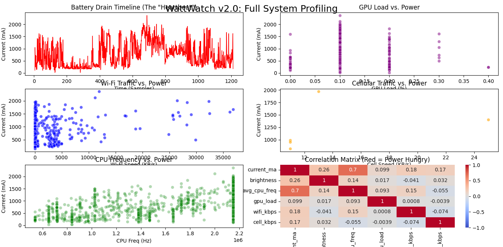
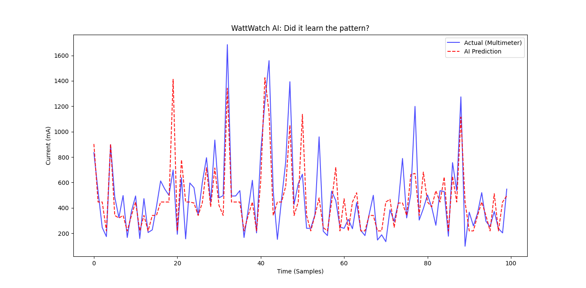

# Watt-Watch 🔋

<div align="center">
  
</div>

**A Machine Learning-Powered Real-Time Hardware Profiler and Security Sentinel for Android.**

## 📖 Overview
Standard Android battery monitors rely on OS-level statistics to tell you *what* drained your battery after the fact. **Watt-Watch** takes a different approach. It acts as an active security sentinel, reading raw hardware telemetry in real-time to detect abnormal power consumption—such as hidden crypto-miners, spyware, or rogue background processes—the exact second it happens.

## ✨ Key Features
* **Raw Hardware Telemetry:** Bypasses the Android API to read directly from `/sys/class/` and `/sys/kernel/` nodes, tracking CPU frequency, GPU load, and Screen Brightness.
* **Dual-Radio Analysis:** Explicitly separates Wi-Fi (`wlan0`) and Cellular (`ccmni1`) traffic to accurately calculate the differing physical power costs of radio transmissions.
* **Edge AI via Model Transpilation:** Trained using XGBoost on a PC, the AI model is transpiled into pure, dependency-free Python using `m2cgen`. This bypasses Termux/Android SELinux restrictions and missing ARM-compiled libraries, allowing complex machine learning inference to run natively and efficiently on edge devices.
* **Real-Time Sentinel:** Runs quietly in the background via Termux. If the actual physical battery current spikes significantly higher than the AI's predicted current, it triggers an instant system alert.

## 📊 How it Works

<div align="center">
  
  <p><i>Figure 2: XGBoost Feature Importance revealing the specific power personality of the device.</i></p>
</div>

1. **Logging Phase (`watt_logger.py`):** Collects a baseline dataset of hardware metrics across various states (idle, gaming, downloading).
2. **Training Phase (PC):** An XGBoost regressor is trained on the CSV data to understand the standard energy footprint of the specific phone.
3. **Transpilation (`translate.py`):** The heavy XGBoost model is converted into raw, pure Python math logic (`brain.py`).
4. **Monitoring Phase (`checker.py`):** The lightweight sentinel watches the hardware nodes 24/7 and flags power anomalies instantly.

## 🚀 Installation & Usage

**Prerequisites:** An Android device with [Termux](https://termux.dev/en/) installed. No root required for basic node access (depending on OEM).

1. **Clone the repository:**
   ```bash
   git clone [https://github.com/sowmiksudo/WattWatch.git](https://github.com/sowmiksudo/WattWatch.git)
   cd WattWatch

```

2. **Run the Logger (Create your baseline):**
```bash
python watt_logger.py

```


*Run this for about 20 minutes while performing different tasks to generate a rich `watt_watch_data.csv`.*
3. **Train & Transpile (On PC):**
Transfer the CSV to your PC and run the training script. This will generate the pure-Python `brain.py` file.
```bash
python train_v2.py
python translate.py

```


4. **Deploy the Sentinel (On Phone):**
Transfer `brain.py` back to your Termux environment and start the security tool:
```bash
python checker.py

```


## 🧑‍💻 About the Author & Related Work

I am passionate about the intersection of Data Science, cybersecurity, and low-level system architecture. I enjoy building tools that extract meaning from the noise of raw hardware and network data.

If you find this project interesting, be sure to check out my other cybersecurity tooling:

* **TCP Traffic Analyzer for Android:** A dynamic analysis tool built using **Frida** and **Python** to intercept, inspect, and reverse-engineer raw TCP traffic from Android applications.

*Currently preparing for a Bachelor's degree in Data Science and Analytics, exploring edge AI and anomaly detection.*

## 📜 License

Distributed under the MIT License. See `LICENSE` for more information.